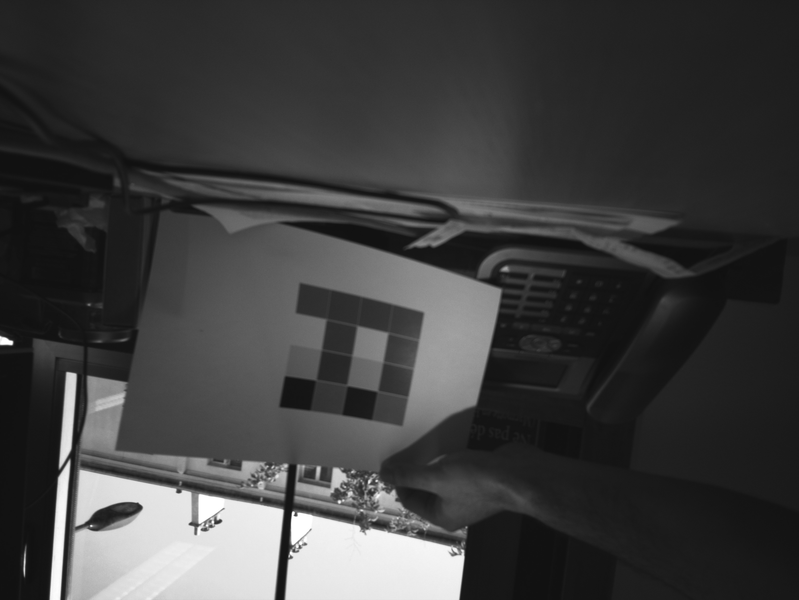
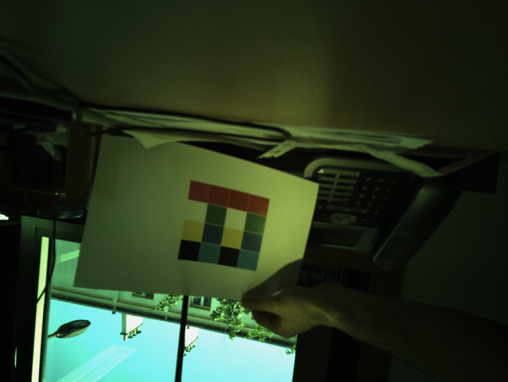
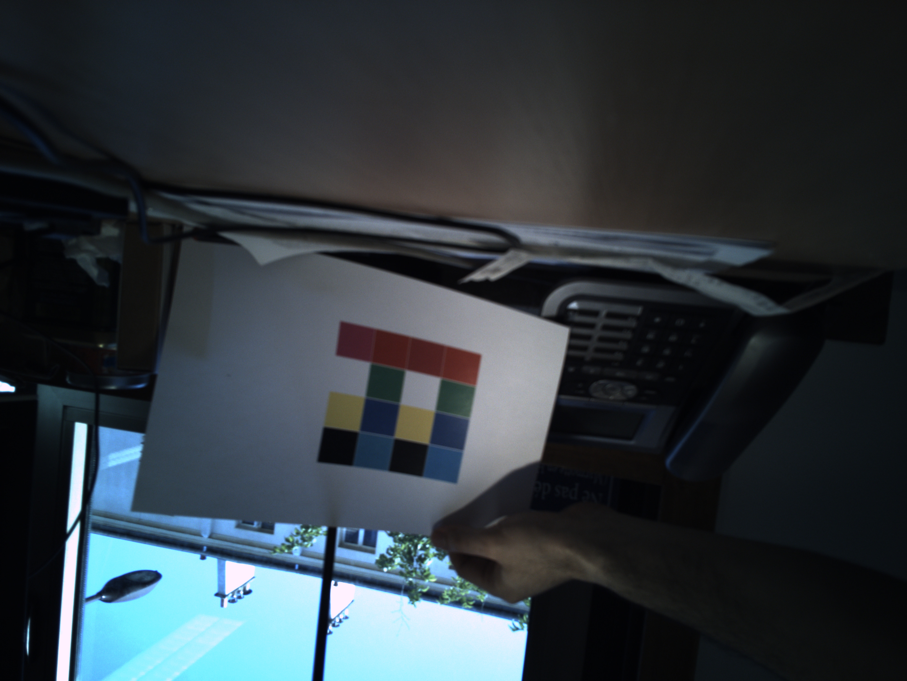

# RGB from RAW

Generate RGB image from a raw image captured

## Algorithm

1. Get raw image



2. Black point detection (compuite minimum of each channel)

3. Substract channel minimum over each channel

4. Debayering



5. White balance



## Build

* Requires [cmake](https://cmake.org/download/)

### Release

```shell
mkdir build
cd build
cmake ..
make -j
```


### Debug

```shell
mkdir build_debug
cd build_debug
cmake ..
make -j
```

## Usage

```
Usage: ./tifo_raw filename.raw width height gain_r grain_b
notice: metada can be found in data/*.meta
```
### Example

```
./tifo_raw ../data/image.raw 3280 2464 1.164 2.328
Saving raw image as pgm (../data/image.raw.pgm)
Saving RGB image as ppm (../data/image.raw.ppm)
Saving white balance RGB image as ppm (../data/image.raw.whitebalance.ppm)
```
